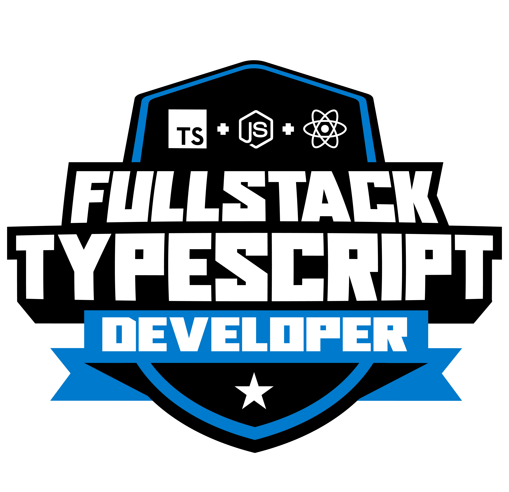

<h1 align='center'> Formacao TypeScript Fullstack Developer

<h1 align='center'></h1>


<h3> Domine o TypeScript, um superset de Javascript mantida pela Microsoft. TypeScript é essencialmente JavaScript com alguns recursos adicionais que traz mais segurança ao desenvolvedor. Leve seu desenvolvimento com Typescript no Front-End com React e para o Back-End com node. Aprenda mais sobre as vantagens da tipagem no seu código, entenda os conceitos de Orientação a Objetos passando por Herança, Encapsulamento, Polimorfismo e Abstração e construa seu projeto baseado em Classes. Evolua seu Back-End com boas práticas de código, entenda como criar servidor com Express e como desenvolver uma API REST.

Desenvolva suas habilidades com React para aplicações Front-End utilizando componentes criados com Typescript, veja como trabalhar com Propriedades tipadas, como deixar o retorno dos conteúdos mais previsíveis e como criar uma integração do seu back-end com o front-end.
<hr>
 
```
Fundamentos do TypeScript - 5 atividades 

```
```
Introdução ao React com TypeScript - 5 atividades 

```
```
Conceitos Avançados de React com TypeScript - 7 atividades

```
```
Introdução ao Node com TypeScript - 5 atividades

```
```
Conceitos Avançados de Node com TypeScript - 5 atividades 

```

